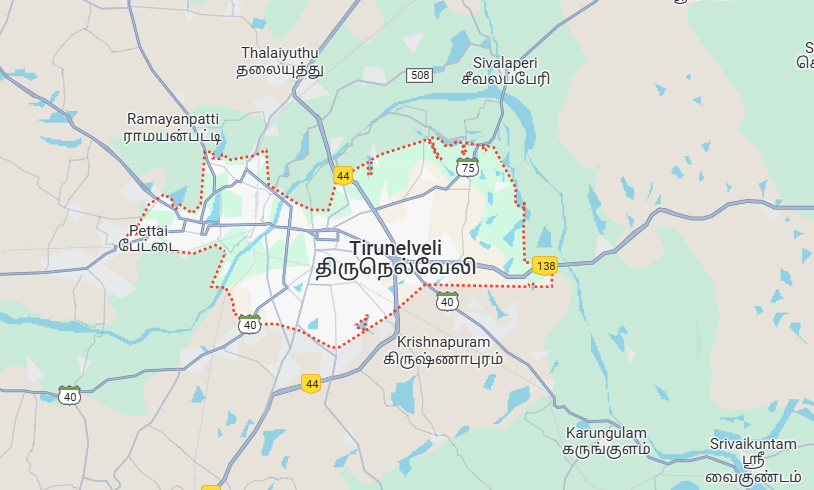

# Ex04 Places Around Me
## Date: 30/11/2024

## AIM
To develop a website to display details about the places around my house.

## DESIGN STEPS

### STEP 1
Create a Django admin interface.

### STEP 2
Download your city map from Google.

### STEP 3
Using ```<map>``` tag name the map.

### STEP 4
Create clickable regions in the image using ```<area>``` tag.

### STEP 5
Write HTML programs for all the regions identified.

### STEP 6
Execute the programs and publish them.

## CODE
```
map.html

<html>
<head>
<title>My City</title>
</head>
   <body>
       <h1 align="center">
           <font colour="red"><b>TIRUNELVELI</b></font>
       </h1>
       <h3 align="center">
           <font colour="blue"><b>SHREE CHANDRU R (24900269)</b></font>
       </h3>
       <center>
          <!-- Image Map Generated by http://www.image-map.net/ -->


<map name="image-map">
    <area target="" alt="home" title="home" href="home.html" coords="464,166,420,208" shape="rect">
    <area target="" alt="river" title="river" href="lake.html" coords="399,394,39" shape="circle">
    <area target="" alt="railway" title="railway" href="railway.html" coords="257,237,275,217,336,174,320,279,264,256" shape="poly">
    <area target="" alt="temple" title="temple" href="temple.html" coords="253,281,312,409" shape="rect">
    <area target="" alt="store" title="store" href="store.html" coords="382,270,43" shape="circle">
</map>
      </map>
       </center>
   </body>
</html>

store.html

<html>
   <head>
       <title>My Home Town</title>
   </head>
<body style="background-color: yellow;">
<h1 align="center">
<font color="red"><b>TIRUNELVELI</b></font>
</h1>
<h3 align="center">
<font color="blue"><b>Super saravana stores - Famous store</b></font>
</h3>
<hr size="3" color="red">
<p align="justify">
<font face="georgia" size="5">
Saravana Stores, founded in 1969, is a chain of retail stores in Ind
It is the largest family owned business retail chain in India.
It is the first store to introduce Aadi Thallupadi sale concept.
Saravana Selvarathinam etc.
</p>
</body>
</html>


temple.html


<html>
<head>
<title>My Home Town</title>
</head>
<body style="background-color: pink;">
<h1 align="center">
<font color="red"><b>TIRUNELVELI</b></font>
</h1>
<h3 align="center">
<font color="blue"><b>NELLAIYAPPAR TEMPLE</b></font>
</h3>
<hr size="3" color="red">
<p align="justify">
<font face="georgia" size="5">
    Nellaiappar Temple is considered to be the prominent Temple than Madurai Temple. 
    It is considered to be a big temple in the city with five Gopurams.
     It spreads over 850 feet long and 756 feet wide in the middle of the city.
     The sannathi of Sri Gandhimathi gives more aesthetic pleasure than the sannathi of Nellaiappar.
</p>
</body>
</html>


railway.html


<html>
<head>
<title>My Home Town</title>
</head>
<body style="background-color: blueviolet;">
<h1 align="center">
<font color="red"><b>TIRUNELVELI</b></font>
</h1>
<h3 align="center">
<font color="blue"><b>Railwaystation</b></font>
</h3>
<hr size="3" color="red">
<p align="justify">
<font face="georgia" size="5">
    Tirunelveli Junction railway station (also known as Nellai Junction railway station)
    (station code: TEN) is an NSG category Indian railway station in Madurai railway division of Southern Railway zone.
    [2] It serves the city of Tirunelveli, located in Tirunelveli district of the Indian state of Tamil Nadu.[3]
    The Nellai Express – a super-fast train connecting Tirunelveli and Chennai Egmore – runs packed almost throughout the year.
    [4] The station is one of the oldest on the Indian railway network, built in 1893.[5]
</p>
</body>
</html>


lake.html


<html>
<head>
<title>My Home Town</title>
</head>
<body style="background-color: aqua;">
<h1 align="center">
<font color="red"><b>TIRUNELVELI</b></font>
</h1>
<h3 align="center">
<font color="blue"><b>Thamirabarani RIVER</b></font>
</h3>
<hr size="3" color="red">
<p align="justify">
<font face="georgia" size="5">
    The Thamirabarani or Tamraparni or Porunai is a perennial river that originates from the Agastyarkoodam peak of Pothigai hills
     of the Western Ghats, above Papanasam in the Ambasamudram taluk.[2] It flows through Tirunelveli and Thoothukudi districts of 
     the Tamil Nadu state of southern India into the Gulf of Mannar. It was called the Tamraparni River in the pre-classical period,
     a name it lent to the island of Sri Lanka. The old Tamil name of the river is Porunai. From the source to sea, the river is about 
     128 kilometres (80 mi) long and is the only perennial river in Tamil Nadu. This river flows towards north direction initially.
      However, it changes to east direction later.
</p>
</body>
</html>

home.html


<html>
   <head>
       <title>My Home Town</title>
   </head>
   <body style="background-color: rgb(241, 136, 223);">
       <h1 align="center">
           <font color="red"><b>TIRUNELVELI</b></font>
       </h1>
       <h3 align="center">
           <font color="blue"><b>TIRUNELVELI - My Home Town</b></font>
       </h3>
       <hr size="3" color="red">
       <p align="justify">
           <font face="georgia" size="5">
               TIRUNELVELI is a good locality.
               It has good connectivity to schools, colleges, hospitals, el
               TIRUNELVELI is a good locality.
               It has good connectivity to bus stands, schools, colleges, t
           </font>
       </p>
   </body>
</html>


```

## OUTPUT

.png>)
.png>)
.png>)
.png>)
.png>)

## RESULT
The program for implementing image maps using HTML is executed successfully.
